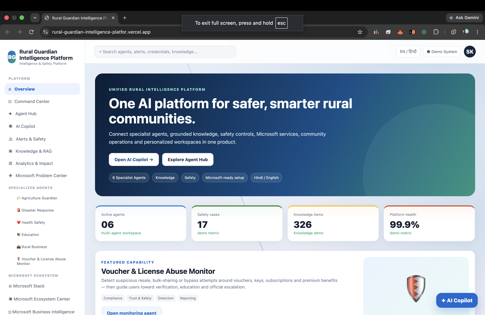
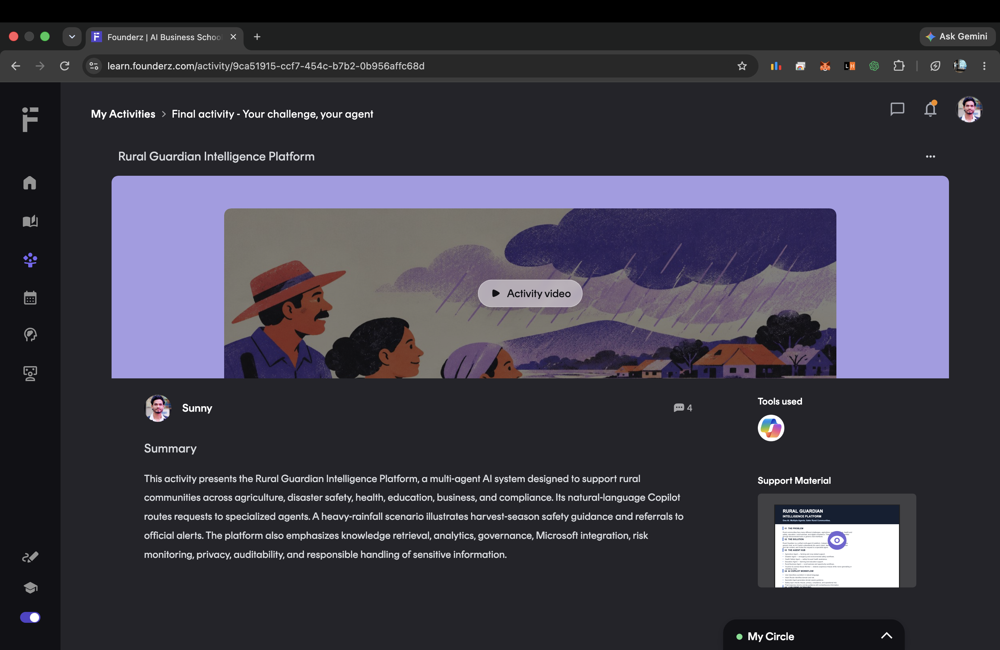

# 🌾 Rural Guardian Intelligence Platform

> **One AI. Multiple Agents. Safer Rural Communities.**

[](https://www.microsoft.com/)
[](https://fastapi.tiangolo.com/)
[](https://www.postgresql.org/)
[](https://redis.io/)
[](LICENSE)

**Rural Guardian Intelligence Platform** is a multi-agent AI platform designed around the needs of rural communities. It brings specialized AI agents, a natural-language Copilot, safety-aware routing, knowledge retrieval, analytics, governance, and responsible-AI controls into one platform.

Built as a **Microsoft Agent-a-Thon prototype**.

---

## 🖥️ Product Preview

### Rural Guardian — Main Dashboard

The main application dashboard and core product experience.



### Microsoft Agent-a-Thon Submission

FounderZ activity page showing the submitted Rural Guardian project, activity video, summary, Microsoft Copilot/agent tooling, and supporting material.



> **Screenshots are kept under `docs/screenshots/` for a clean repository structure. Upload the two images there to render them directly in this section.**

---

## 🚀 The Problem

Rural communities deal with problems across multiple domains:

- 🌾 Agriculture and crop-related decisions
- 🌧️ Disaster and environmental safety
- 🩺 Health and safety
- 🎓 Education
- 🏪 Rural business
- 🛡️ Compliance, voucher and license misuse

A generic chatbot treats these requests similarly. Rural Guardian instead uses **specialized agents + intent/risk routing + a shared safety layer**.

---

## 💡 The Solution

### One AI. Multiple Agents.

A user does not need to know which specialist to contact.

```text
User
  ↓
AI Copilot
  ↓
Intent + Risk Router
  ↓
Specialist Agent
  ↓
Safety / Compliance Guard
  ↓
Grounded, Actionable Response
```

This architecture makes the platform modular, domain-aware, and easier to govern.

---

## 🤖 Agent Hub

| Agent | Purpose |
|---|---|
| 🌾 **Agriculture Agent** | Agriculture and crop-related support |
| 🌧️ **Disaster Agent** | Emergency and environmental safety workflows |
| 🩺 **Health Safety Agent** | Safety-focused health assistance |
| 🎓 **Education Agent** | Learning and education workflows |
| 🏪 **Rural Business Agent** | Rural business and opportunity workflows |
| 🛡️ **Voucher & License Abuse Monitor** | Detects suspicious misuse without generating or validating codes |

---

## 🧠 AI Copilot

The **AI Copilot** is the central interaction layer.

Users describe their situation in natural language, and the platform identifies the relevant domain and risk context before routing the request to a specialist agent.

### Example

> **“My village has heavy rain and wheat is ready for harvest. What should I do?”**

The platform recognizes a potential disaster context and routes the request to the **Disaster Agent**, which provides immediate safety-focused guidance and points users toward official local authorities for live alerts.

---

## 🏗️ Architecture

```text
┌─────────────────────┐
│       User          │
└──────────┬──────────┘
           ↓
┌─────────────────────┐
│     AI Copilot      │
└──────────┬──────────┘
           ↓
┌─────────────────────┐
│ Intent + Risk Router│
└──────────┬──────────┘
           ↓
┌───────────────────────────────────┐
│        Specialist Agents          │
│ Agriculture • Disaster • Health   │
│ Education • Business • Compliance │
└──────────┬────────────────────────┘
           ↓
┌─────────────────────┐
│ Safety / Compliance │
│       Guard         │
└──────────┬──────────┘
           ↓
┌─────────────────────┐
│  Final Response     │
└─────────────────────┘
```

### Backend foundation

```text
Frontend
   │
   ▼
FastAPI
   │
   ├── Authentication / Sessions
   ├── CSRF Protection
   ├── Rate Limiting
   ├── Agent Routing
   ├── Safety Policy
   └── Audit Logging
        │
   ┌────┼──────────────┐
   ▼    ▼              ▼
PostgreSQL  Redis   AI Adapters
+ pgvector           │
              ┌──────┼──────────┐
              ▼      ▼          ▼
         OpenRouter Foundry Azure OpenAI
```

---

## 🛡️ Responsible AI & Safety

Safety is a shared platform capability.

Rural Guardian is designed to:

- Detect potential misuse, fraud, policy violations, and operational risk.
- Avoid generating, validating, storing, or distributing secrets, keys, vouchers, license codes, or premium benefits.
- Recommend verification, education, internal review, logging, and escalation when risk is detected.
- Direct emergency situations toward official authorities.
- Keep model credentials server-side.
- Maintain auditability through request tracking and logging.

> **Risk detection is not accusation.** The system identifies signals and recommends safe next steps.

---

## 🧩 Platform Modules

- Overview
- Command Center
- Agent Hub
- AI Copilot
- Alerts & Safety
- Knowledge & RAG
- Analytics & Impact
- Specialized Agents
- Microsoft Ecosystem
- Microsoft Business Intelligence
- Microsoft Risk & Reliability
- Certification Hub
- Voucher Protection
- Profile Dashboard
- Admin & Governance
- Settings

---

## ☁️ AI Integrations

The backend supports provider adapters for:

- **OpenRouter**
- **Microsoft Foundry**
- **Azure OpenAI**

Secrets are kept server-side and excluded from Git through `.gitignore`.

---

## 🔐 Engineering & Security

- FastAPI
- SQLAlchemy 2
- PostgreSQL + pgvector
- Redis
- Alembic
- JWT/session authentication
- Argon2 password hashing
- CSRF protection
- Rate limiting
- Request IDs
- Structured logging
- Health/readiness/metrics
- Docker Compose
- Nginx
- Server-side AI credentials

---

## 🧪 Demo & Verification

### Run locally

```bash
docker compose up --build
```

Open:

```text
Frontend  → http://localhost:5173
Backend   → http://localhost:8000/api/health
```

Run backend tests:

```bash
cd backend
pytest -q
```

The packaged source was verified with Python compilation, backend tests, frontend JavaScript syntax checks, and ZIP integrity checks.

---

## 📁 Project Structure

```text
Rural-Guardian-Intelligence-Platform/
├── frontend/
│   ├── index.html
│   ├── Dockerfile
│   └── nginx.conf
├── backend/
│   ├── app/
│   ├── tests/
│   ├── Dockerfile
│   └── requirements.txt
├── docs/
│   └── screenshots/
├── scripts/
├── docker-compose.yml
├── .env.example
├── .gitignore
└── README.md
```

---

## 📄 License

This project is released under the **MIT License**. See [LICENSE](LICENSE).

---

## 🌐 Live Project

### Live Frontend
https://rural-guardian-intelligence-platform-1d8ic8odv.vercel.app

### Source Code
https://github.com/SunnyAgrwl05/rural-guardian-intelligence-platform

---

## 🎯 Vision

> **One AI. Multiple Agents. Safer Rural Communities.**

Rural Guardian aims to turn reusable expertise into specialized, governable AI agents that can support different rural scenarios while sharing a common safety and compliance foundation.

---

## 👨‍💻 Built by

**Sunny Kumar**  
Microsoft Agent-a-Thon Prototype

